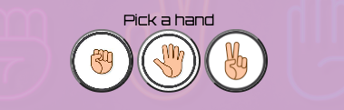
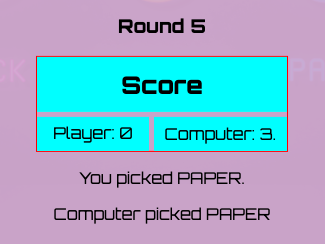
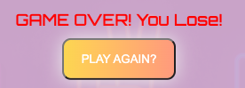

# rock-paper-scissors

This is a Rock Paper Scissors game, built with HTML, CSS and JavaScript. Users have the ability to pick a hand by clicking a button. The computer will also pick a hand. The score is displayed on the scoreboard. At the end of five rounds, the player with the highest score wins.

# Features

1. Hand Buttons

- The hand buttons allow the user to pick a hand.
- They have a background image to help visually identidy your choice.
- The choices are as follows:
  - Rock
  - Paper
  - Scissors

# Score

1. The scoreboard is displayed below the buttons.
2. The scoreboard displays:
  - The round (1 - 5)
  - The user and computer score
  - The user and computer hand

# Winner

1. After 5 rounds, a message pops up announcing if the user wins or loses.
2. A play again button appears which resets the state of the game.

# Testing

- Buttons work as expected.
- Game finishes after 5 rounds and buttons will not work, as expected.
- Play again button resets score count and allows user to play again

# Validator Testing

- No errors returned after passing HTML through [W3C Validator](https://validator.w3.org/nu/)
- No errors returned after passing CSS through [Jigsaw CSS Validator](https://jigsaw.w3.org/css-validator/validator)
- JavaScript passes through validator with only minor error
  - Error: unexpected const

# Credit

- Rock/Paper/Scissors images
  - John3 @ toppng.com:
  - https://toppng.com/rock-paper-scissors-circle-PNG-free-PNG-Images_182118
- Background body image
  - Human Vectors by Vecteezy:
  - https://www.vecteezy.com/free-vector/human

# Deployment

This website is hosted in GitHub pages.

Steps:

- In repository, go to _settings_
- Under _code and automation_ sidebar, select _pages_
- Under source select _deploy from branch_
- Under branch selest _main_
- Save
